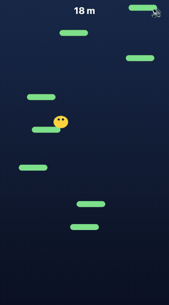

# Hoppala 🟡

Endless vertical jumper for your phone's browser. Drag to steer, bounce forever,
climb from the ground into the stars.

**Play:** https://hoppala.vercel.app — add it to your home screen, works offline.

## How it's built

- Vanilla TypeScript + Canvas 2D — no game engine, **zero runtime dependencies**, < 60KB gzip.
- Pure, deterministic simulation (`src/game/`) with a seeded PRNG — physics, procedural
  platform generation and the difficulty curve are all unit-tested (Vitest), including a
  reachability invariant: the generator can never produce an impossible board.
- Fixed-timestep loop, relative-drag steering (Pointer Events), altitude-reactive
  procedural rendering, WebAudio-synthesized sfx, PWA offline support.

## Develop

pnpm install · `pnpm dev` · `pnpm test` · `pnpm build`
